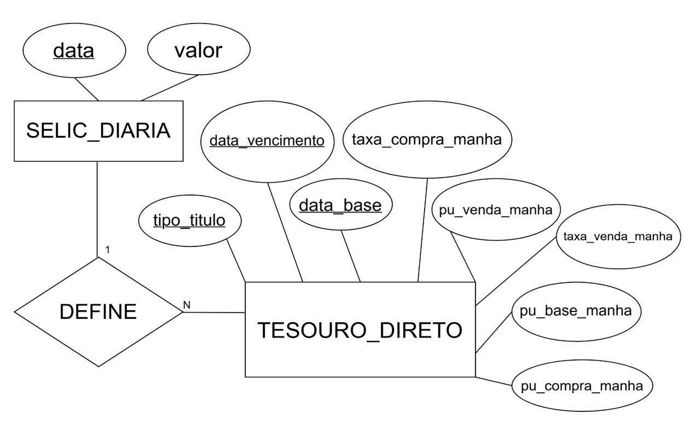

# Taxa SELIC e Tesouro Direto — Dados Públicos Integrados

> Trabalho Prático — Introdução a Bancos de Dados (IBD)
> Universidade Federal de Minas Gerais — DCC/UFMG — 1º Semestre de 2026

**Autores:** Davi Ladeira Balsamão · Enzo de Freitas Alencar · Fernando Thales Santana Lopes · Otávio Fagundes Rodrigues de Oliveira · Pedro Puliti Dias

---

## Sobre este repositório

Este repositório contém os dados organizados e documentação referentes à análise integrada da **taxa SELIC diária** (Banco Central do Brasil) e dos **preços e taxas do Tesouro Direto** (Tesouro Nacional), cobrindo o período de janeiro de 2021 a dezembro de 2025.

---

## Fontes de dados

| # | Fonte | Órgão produtor | URL | Licença |
|---|-------|---------------|-----|---------|
| 1 | Taxa SELIC Diária — Série SGS nº 11 | Banco Central do Brasil (BACEN) | https://dadosabertos.bcb.gov.br/dataset/11-taxa-de-juros---selic | Dados públicos — LAI (Lei nº 12.527/2011) |
| 2 | Histórico de Preços e Taxas do Tesouro Direto | Tesouro Nacional | https://www.tesourodireto.com.br/titulos/historico-de-precos-e-taxas.htm | Dados públicos — LAI (Lei nº 12.527/2011) |

### Processo de aquisição

Os arquivos foram baixados diretamente dos portais oficiais em formato CSV (separador `;`, decimais com vírgula). O script `tratar_dados.py` realizou as seguintes transformações:

- Conversão das datas de `DD/MM/AAAA` para ISO 8601 (`AAAA-MM-DD`)
- Substituição de vírgulas por pontos nos campos decimais
- Geração dos arquivos `selic_limpo.csv` e `tesouro_absoluto.csv`

**Data de obtenção:** 2026
**Cobertura temporal:** 04/01/2021 a 31/12/2025
**Total de registros:** 1.256 (SELIC) + 52.706 (Tesouro Direto) = **53.962 registros**

---

## Dicionário de dados

### Tabela `selic_diaria`

| Coluna | Tipo SQL | Chave | Descrição | Valores esperados |
|--------|----------|-------|-----------|-------------------|
| `data` | `DATE` | PK | Data útil de referência (ISO 8601) | 2021-01-04 a 2025-12-31 |
| `valor` | `NUMERIC(10,6)` | — | Taxa SELIC efetiva diária (% ao dia) | 0,007469 a 0,055131 no período (≈ 2% a 15% a.a.) |

### Tabela `tesouro_direto`

| Coluna | Tipo SQL | Chave | Descrição | Valores esperados |
|--------|----------|-------|-----------|-------------------|
| `tipo_titulo` | `VARCHAR(80)` | PK | Nome do título (ex.: Tesouro IPCA+ 2029) | Ver lista abaixo |
| `data_vencimento` | `DATE` | PK | Data de vencimento do título | Datas futuras a partir de 2024 |
| `data_base` | `DATE` | PK + FK | Data útil de cotação — FK para `selic_diaria.data` | 2021-01-04 a 2025-12-30 |
| `taxa_compra_manha` | `NUMERIC(8,4)` | — | Taxa de compra divulgada pela manhã (% a.a.) | Pode ser NULL¹ |
| `taxa_venda_manha` | `NUMERIC(8,4)` | — | Taxa de venda divulgada pela manhã (% a.a.) | 2,0 a 15,0 aprox. |
| `pu_compra_manha` | `NUMERIC(12,6)` | — | Preço unitário de compra pela manhã (R$) | Pode ser NULL¹ |
| `pu_venda_manha` | `NUMERIC(12,6)` | — | Preço unitário de venda pela manhã (R$) | > 0 |
| `pu_base_manha` | `NUMERIC(12,6)` | — | Preço unitário base pela manhã (R$) | > 0 |

> ¹ Campos de compra podem ser `NULL` quando o Tesouro suspendeu a recompra do título naquele dia — comportamento esperado, não erro de dados.

### Tipos de título presentes no conjunto

| Categoria | Exemplos de tipo_titulo |
|-----------|------------------------|
| Indexado à SELIC | Tesouro Selic 2026, Tesouro Selic 2027, Tesouro Selic 2029 |
| Prefixado | Tesouro Prefixado 2026, Tesouro Prefixado 2027, Tesouro Prefixado com Juros Semestrais 2033 |
| Indexado ao IPCA | Tesouro IPCA+ 2029, Tesouro IPCA+ 2035, Tesouro IPCA+ com Juros Semestrais 2040 |
| Renda+ / Educa+ | Tesouro Renda+ 2030, Tesouro Educa+ 2029 |

### Metadados gerais

| Atributo | SELIC Diária | Tesouro Direto |
|----------|-------------|----------------|
| Órgão produtor | Banco Central do Brasil | Tesouro Nacional |
| Data de obtenção | Janeiro de 2026 | Janeiro de 2026 |
| Cobertura temporal | 04/01/2021 – 31/12/2025 | 04/01/2021 – 30/12/2025 |
| Periodicidade | Diária (dias úteis) | Diária (dias úteis) |
| Cobertura geográfica | Brasil | Brasil |
| Formato original | CSV `;` — decimal `,` | CSV `;` — decimal `,` |
| Formato neste repositório | CSV `;` — decimal `.` | CSV `;` — decimal `.` |
| Licença | Dados públicos — LAI | Dados públicos — LAI |

---
## Esquema Conceitual (Modelo ER)

---
## Análise crítica das fontes

### Taxa SELIC Diária (BACEN — Série SGS nº 11)

- Cobertura apenas de dias úteis bancários: ausência de entradas em fins de semana e feriados exige cuidado em análises de intervalos de tempo contínuos e no cálculo de retornos acumulados.
- Granularidade: a série representa a taxa efetiva média do dia, publicada pelo BACEN com atraso de um dia útil. Não captura valores ao longo do dia para análises intraday e não reflete expectativas futuras.
- Limitação estrutural: a série utilizada (SGS nº 11) representa a taxa SELIC efetiva **diária** (% ao dia), e não a taxa SELIC "oficial" divulgada pelo Copom, que é anualizada considerando 252 dias úteis. Comparações ou conversões entre as duas convenções (diária ↔ anualizada) devem ser feitas com cuidado para evitar interpretações equivocadas dos valores.

### Preços e Taxas do Tesouro Direto (Tesouro Nacional)

- Cotações apenas da manhã: o arquivo não disponibiliza cotações ao longo do pregão. Análises de valores em um mesmo dia são impossíveis com esta fonte.
- Descontinuidade de títulos: títulos emitidos antes de 2021 e retirados de circulação antes do período analisado não aparecem, criando viés de sobrevivência para análises de longo prazo.
- Heterogeneidade dos tipos de título: a coluna tipo_titulo mistura informações de categoria (IPCA+, Prefixado, Selic), produto (Renda+, Educa+) e vencimento em alguns casos, dificultando agrupamentos sem normalização prévia.
- Ausência de volume negociado: os dados de preços e taxas não incluem volume financeiro, impedindo análises de liquidez efetiva.

---

*UFMG / DCC — Introdução a Bancos de Dados — 1º Semestre de 2026*
